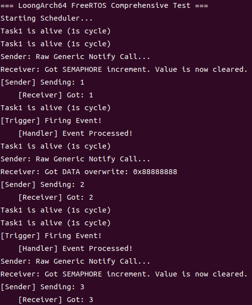
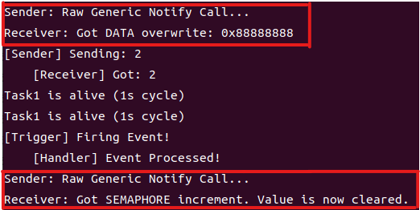

# 项目介绍
## FreeRTOS  
FreeRTOS（Free Real-Time Operating System）是一款开源的实时操作系统内核。LoongArch是由我国龙芯中科研发的自主指令系统（龙芯架构）。  
本项目将FreeRTOS移植到LoongArch平台上，在Ubuntu 20.04中通过QEMU模拟器（在PC上模拟LoongArch硬件）编译FreeRTOS并运行。  

## 配置交叉编译环境  
本实验所用的交叉编译工具链为：  
https://github.com/loongson/build-tools/releases/download/2025.08.08/x86_64-cross-tools-loongarch64-binutils_2.45-gcc_15.1.0-glibc_2.42.tar.xz  
下载后通过共享文件夹到Ubuntu  
设置路径：  
```
export PATH="{/path/to/cross-tools}/bin:$PATH"
```
上述的命令只是临时设置环境变量，如需永久设置，可通过修改/etc/profile实现；   
## 编译FreeRTOS
下载FreeRTOS-loongarch
```
git clone git@github.com:bzy666-666/FreeRTOS-loongarch.git
cd FreeRTOS-loongarch
```
开始编译
```
make all
```
运行
```
make run
```

## 结构目录
```
FreeRTOS_loongArch/  
├── Makefile                  
├── link.ld                   
├── start.S                    
├── FreeRTOSConfig.h           
│  
├── app/                       # [应用层]  
│   └── main.c                 
│  
└── FreeRTOS-Kernel/           # [内核层] 官方源码 (不要动!)  
    ├── tasks.c                # 任务调度核心  
    ├── queue.c                # 队列通信  
    ├── list.c                 # 链表实现  
    ├── timers.c               # 软件定时器  
    │  
    ├── include/               # [头文件]   
    │   ├── FreeRTOS.h  
    │   ├── task.h  
    │   └── ...    
    │  
    └── portable/              # [移植层]   
        ├── MemMang/  
        │   └── heap_4.c       # 内存管理 (pvPortMalloc)  
        │  
        └── GCC/    
            └── LoongArch64/   # [核心移植]    
                ├── portmacro.h # 数据类型定义  
                ├── port.c      # C接口: 栈初始化, 定时器配置    
                └── portASM.S   # 汇编接口: 上下文切换, ISR入口   
```

# 移植主要工作

## port.c
### 初始化任务栈
```
StackType_t *pxPortInitialiseStack( StackType_t *pxTopOfStack, TaskFunction_t pxCode, void *pvParameters )
{
    uint64_t ullStackTop = ( uint64_t ) pxTopOfStack;
    ullStackTop &= ~( ( uint64_t ) 0x0f );
    pxTopOfStack = ( StackType_t * ) ullStackTop;

    pxTopOfStack -= 34; // 32 GPRs + ERA + PRMD

    for (int i = 0; i < 34; i++) {
        pxTopOfStack[i] = 0;
    }
    
    pxTopOfStack[0] = 0;

    pxTopOfStack[1] = (StackType_t) prvTaskExitError;

    pxTopOfStack[4] = (StackType_t) pvParameters;

    pxTopOfStack[22] = 0;

    pxTopOfStack[32] = (StackType_t) pxCode;

    pxTopOfStack[33] = 0x4;

    return pxTopOfStack;
}
```
对传入的pxTopOfStack进行16字节对齐，预留出32个通用寄存器+ERA寄存器（存跳转的地址）和PRMD寄存器（设置优先级），将预留了上下文的栈顶地址传回。
  
### 启动调度器 
```
BaseType_t xPortStartScheduler( void )
{
    uxCriticalNesting = 0;

    vPortSetupTimerInterrupt();

    xPortStartFirstTask();

    return 0;
}

void vPortEndScheduler( void )
{

}
```
配置硬件定时器中断
```
void vPortSetupTimerInterrupt( void )
{
    unsigned long ulConstFreq = configCPU_CLOCK_HZ; 
    unsigned long ulTickValue = ulConstFreq / configTICK_RATE_HZ;
    unsigned long ulTCFG = (ulTickValue << 2) | 3;
    __asm__ volatile ( "csrwr %0, 0x41" : : "r"(ulTCFG) );


    unsigned long ulECFG;
    __asm__ volatile ( "csrrd %0, 0x4" : "=r"(ulECFG) );
    ulECFG |= (1 << 11);
    __asm__ volatile ( "csrwr %0, 0x4" : : "r"(ulECFG) );
}
```
在启动前，将嵌套计数清零，防止死锁，配置硬件定时中断，配置时间中断配置寄存器TCFG，以及例外配置寄存器ECFG,最后启动第一个任务。

### 临界区管理
```
void vPortEnterCritical( void )
{
    portDISABLE_INTERRUPTS();
    uxCriticalNesting++;
}

void vPortExitCritical( void )
{
    if( uxCriticalNesting > 0 )
    {
        uxCriticalNesting--;
        if( uxCriticalNesting == 0 )
        {
            portENABLE_INTERRUPTS();
        }
    }
}
```
进入临界区禁用中断、增加嵌套计数，确保关键代码段不被中断打断，退出临界区，减少嵌套计数，当计数值为0，说明完全退出，可以重新启用中断。  

## portASM.S
### 启动第一个任务
```
xPortStartFirstTask:

RESTORE_CONTEXT  
    
.align 4
```
RESTORE_CONTEXT
```
.macro RESTORE_CONTEXT
    la.global $t0, pxCurrentTCB
    ld.d      $t1, $t0, 0       
    ld.d      $sp, $t1, 0       

    ld.d      $t0, $sp, 8*33
    csrwr     $t0, 0x1          /* CSR_PRMD */
    ld.d      $t0, $sp, 8*32
    csrwr     $t0, 0x6          /* CSR_ERA */

    ld.d    $r1,  $sp, 8*1
    ld.d    $r2,  $sp, 8*2
    ld.d    $r4,  $sp, 8*4
    ld.d    $r5,  $sp, 8*5
    ld.d    $r6,  $sp, 8*6
    ld.d    $r7,  $sp, 8*7
    ld.d    $r8,  $sp, 8*8
    ld.d    $r9,  $sp, 8*9
    ld.d    $r10, $sp, 8*10
    ld.d    $r11, $sp, 8*11
    ld.d    $r12, $sp, 8*12
    ld.d    $r13, $sp, 8*13
    ld.d    $r14, $sp, 8*14
    ld.d    $r15, $sp, 8*15
    ld.d    $r16, $sp, 8*16
    ld.d    $r17, $sp, 8*17
    ld.d    $r18, $sp, 8*18
    ld.d    $r19, $sp, 8*19
    ld.d    $r20, $sp, 8*20
    ld.d    $r21, $sp, 8*21
    ld.d    $r22, $sp, 8*22
    ld.d    $r23, $sp, 8*23
    ld.d    $r24, $sp, 8*24
    ld.d    $r25, $sp, 8*25
    ld.d    $r26, $sp, 8*26
    ld.d    $r27, $sp, 8*27
    ld.d    $r28, $sp, 8*28
    ld.d    $r29, $sp, 8*29
    ld.d    $r30, $sp, 8*30
    ld.d    $r31, $sp, 8*31

    addi.d  $sp, $sp, 272

    ertn
.endm
```
从pxCurrentTCB的第0偏移读取八字节得到SP，恢复特殊寄存器（CSR_PRMD、CSR_ERA），以及通用寄存器，最后回收栈空间，通过ertn跳转。

### 异常处理入口函数
```
freertos_loongarch_trap_handler:
    SAVE_CONTEXT

    csrrd   $t0, 0x5
    
    srli.d  $t1, $t0, 16
    andi    $t1, $t1, 0x3F
    li.d    $t2, 0xB
    beq     $t1, $t2, handle_yield

    li.d    $t2, 0x800      /* 1 << 11 */
    and     $t1, $t0, $t2
    bnez    $t1, handle_tick

    b       exit_trap

handle_yield:
    ld.d    $t0, $sp, 8*32  /* 从栈里读出保存的 ERA */
    addi.d  $t0, $t0, 4     /* 跳过当前指令 (4字节) */
    st.d    $t0, $sp, 8*32  /* 写回栈里 */

    bl      vTaskSwitchContext
    b       exit_trap

handle_tick:
    li.d    $t0, 1
    csrwr   $t0, 0x44 

    bl      xTaskIncrementTick

    beq     $r4, $zero, exit_trap
    
    bl      vTaskSwitchContext
    b       exit_trap

exit_trap:
    RESTORE_CONTEXT
```
SAVE_CONTEXT
```
.macro SAVE_CONTEXT
    addi.d  $sp, $sp, -272

    st.d    $r1,  $sp, 8*1   /* ra */
    st.d    $r2,  $sp, 8*2   /* tp */

    st.d    $r4,  $sp, 8*4   /* a0 */
    st.d    $r5,  $sp, 8*5
    st.d    $r6,  $sp, 8*6
    st.d    $r7,  $sp, 8*7
    st.d    $r8,  $sp, 8*8
    st.d    $r9,  $sp, 8*9
    st.d    $r10, $sp, 8*10
    st.d    $r11, $sp, 8*11
    st.d    $r12, $sp, 8*12
    st.d    $r13, $sp, 8*13
    st.d    $r14, $sp, 8*14
    st.d    $r15, $sp, 8*15
    st.d    $r16, $sp, 8*16
    st.d    $r17, $sp, 8*17
    st.d    $r18, $sp, 8*18
    st.d    $r19, $sp, 8*19
    st.d    $r20, $sp, 8*20
    st.d    $r21, $sp, 8*21
    st.d    $r22, $sp, 8*22  /* fp */
    st.d    $r23, $sp, 8*23
    st.d    $r24, $sp, 8*24
    st.d    $r25, $sp, 8*25
    st.d    $r26, $sp, 8*26
    st.d    $r27, $sp, 8*27
    st.d    $r28, $sp, 8*28
    st.d    $r29, $sp, 8*29
    st.d    $r30, $sp, 8*30
    st.d    $r31, $sp, 8*31

    csrrd   $t0, 0x6   /* CSR_ERA */
    st.d    $t0, $sp, 8*32
    csrrd   $t0, 0x1   /* CSR_PRMD */
    st.d    $t0, $sp, 8*33

    la.global $t0, pxCurrentTCB
    ld.d      $t1, $t0, 0       
    st.d      $sp, $t1, 0       
.endm
```
在start.S指定这里为EENTRY 指向的地方，当有异常就跳转到这里，首先保存现场SAVE_CONTEXT，首先开辟出34*8=272字节的空间，保存34个寄存器，再将当前的SP保存到TCB中。读取CSR_ESTAT判断是谁触发的： A. 检查 Syscall (Yield) -> ECODE 位 (21:16) 是否为 0xB，进入handle_yield； B. 检查 Timer 中断 -> 检查中断标志位，进入handle_tick。
```
handle_yield:
    ld.d    $t0, $sp, 8*32 
    addi.d  $t0, $t0, 4     
    st.d    $t0, $sp, 8*32  

    bl      vTaskSwitchContext
    b       exit_trap
```
从栈里读出保存的era地址，加载下一条指令的地址（4字节），保存到ern寄存器。切换上下文
```
handle_tick:
    li.d    $t0, 1
    csrwr   $t0, 0x44 

    bl      xTaskIncrementTick

    beq     $r4, $zero, exit_trap
    
    bl      vTaskSwitchContext
    b       exit_trap
```
将定时中断清除寄存器的0位置1，清楚中断标记，告诉FreeRTOS时间流逝，如果 xTaskIncrementTick 返回非0，说明需要切换任务，然后切换上下文。

# 测试代码


## 以app/simple_main.c为例介绍FreeRTOS运行过程
```
int main(void) {

    uart_init();

    uart_print("\r\n=== LoongArch64 FreeRTOS Demo ===\r\n");


    xTaskCreate(vTask1, "Task1", 1024, "Task1", 1, NULL);

    xTaskCreate(vTask2, "Task2", 1024, "Task2", 2, NULL);


    uart_print("Starting Scheduler...\r\n");

    vTaskStartScheduler();


    /* 不应该运行到这里 */

    for(;;);

    return 0;

}
```
由link.ld，进入_start，做了：
1. 设置栈指针
2. 将异常函数入口地址存入CSR_EENTRY寄存器
3. 清空bss段
4. 跳转到main函数

通过xTaskCreate创建两个任务（进程）
1. 参数1是实现函数，参数2是函数名称，参数3是栈得深度，参数4是任务优先级，参数5是任务句柄（不需要就是NULL）
2. 在task.c中调用xTaskCreate完成了：
a. 创建任务prvCreateTask：申请TCB的内存以及申请的1024栈深度的内存，返回指向分配的内存块的起始地址的指针，然后调用prvInitialiseNewTask初始化这个任务，将该任务的栈顶设置为刚才分配的1024内存指向的地址（需要地址对齐），同样设置了栈底。将任务名称、优先级、放到TCB里，初始化状态链表和事件链表(看一下实现)，最后进入port.c的pxPortInitialiseStack初始化任务栈
b. 添加任务到就序列表prvAddNewTaskToReadyList：如果当前的tcb为NULL，则创建的任务为当前就绪任务，否则当调度器还没有调度时，判断当前任务和添加的任务的优先级，选择优先级高的为当前的就绪任务。
3. 在task.c中调用vTaskStartScheduler完成调度的开启，最后调用xPortStartScheduler，启动优先级最高的任务（这里是Task2）。

当Task2调用vTaskDelay(pdMS_TO_TICKS(500))时，会将Task2从就序列表放到延迟列表并设置延迟时间，然后触发taskyield，进入异常处理函数的入口，进行上下文切换判断是否需要切换到Task1。

完整测试代码默认为app/main.c。运行结果如下图：  
    

## 任务通知
我们使用队列、信号量、事件组等等方法时，并不知道对方是谁。使用任务通知时，可以明确指定：通知哪个任务。
定义：
#define xTaskNotify( xTaskToNotify, ulValue, eAction ) \
    xTaskGenericNotify( ( xTaskToNotify ), ( tskDEFAULT_INDEX_TO_NOTIFY ), ( ulValue ), ( eAction ), NULL )
#define ulTaskNotifyTake( xClearCountOnExit, xTicksToWait ) \
    ulTaskGenericNotifyTake( ( tskDEFAULT_INDEX_TO_NOTIFY ), ( xClearCountOnExit ), ( xTicksToWait ) )
```
BaseType_t xTaskGenericNotify( TaskHandle_t xTaskToNotify,
                               UBaseType_t uxIndexToNotify,
                               uint32_t ulValue,
                               eNotifyAction eAction,
                               uint32_t * pulPreviousNotificationValue )
```
xTaskToNotify：要通知的目标任务句柄  
uxIndexToNotify：通知索引（支持多个通知）  
ulValue：通知携带的值  
eAction：如何处理通知值  
pulPreviousNotificationValue：输出参数，返回之前的值  
eAction参数说明：  
:::{list-table} eNotifyAction 取值与功能详解
:widths: 25 75
:header-rows: 1

* - eNotifyAction取值
  - 说明
* - eNoAction
  - 仅仅是更新通知状态为“pending”，未使用 `ulValue`。这个选项相当于轻量级的、更高效的二进制信号量。
* - eSetBits
  - 通知值 = 原来的通知值 | `ulValue`，按位或。相当于轻量级的、更高效的事件组。
* - eIncrement
  - 通知值 = 原来的通知值 + 1，未使用 `ulValue`。相当于轻量级的、更高效的二进制信号量、计数型信号量。相当于 xTaskNotifyGive() 函数。
* - eSetValueWithoutOverwrite
  - 不覆盖。如果通知状态为“pending”(表示有数据未读)，则此次调用 `xTaskNotify` 不做任何事，返回 `pdFAIL`。如果通知状态不是“pending”(表示没有新数据)，则：通知值 = `ulValue`。
* - eSetValueWithOverwrite
  - 覆盖。无论如何，不管通知状态是否为“pending”，通知值 = `ulValue`。
:::

```
uint32_t ulTaskGenericNotifyTake( UBaseType_t uxIndexToWaitOn,
                                  BaseType_t xClearCountOnExit,
                                  TickType_t xTicksToWait )
```
uxIndexToWaitOn：要等待的通知索引  
xClearCountOnExit：退出时如何处理计数值  
xTicksToWait：最大等待时间  
### 测试代码
```
xTaskCreate(vTaskReceiver, "Receiver", 1024, NULL, 4, &xReceiverTaskHandle);
xTaskCreate(vTaskSender,   "Sender",   1024, NULL, 3, NULL);

void vTaskSender(void *pvParameters)
{
    uint32_t ulLoopCount = 0;

    for( ;; )
    {
        vTaskDelay( 2000 );
        ulLoopCount++;

        if( xReceiverTaskHandle != NULL )
        {
            uart_print("Sender: Raw Generic Notify Call...\r\n");

            if( ulLoopCount % 2 != 0 )
            {
                xTaskGenericNotify( 
                    xReceiverTaskHandle, 
                    0, 
                    0,              /* 忽略 */
                    eIncrement,     /* ++ */
                    NULL 
                );
            }
            /* 2. 偶数次循环：发送具体数据 (Index 0, Action=Overwrite) */
            else
            {
                xTaskGenericNotify( 
                    xReceiverTaskHandle, 
                    0, 
                    0x88888888,                 
                    eSetValueWithOverwrite,     
                    NULL 
                );
            }
        }
    }
}


void vTaskReceiver(void *pvParameters)
{
    uint32_t ulNotifiedValue;

    for( ;; )
    {
      
        ulNotifiedValue = ulTaskGenericNotifyTake( 
            0,              /* uxIndexToWaitOn: 等待 Index 0 */
            pdTRUE,         /* xClearCountOnExit: 必须为 TRUE (二值模式/全清模式) */
            portMAX_DELAY   /* xTicksToWait: 死等 */
        );

        if( ulNotifiedValue == 0x88888888 )
        {
            uart_print("Receiver: Got DATA overwrite: 0x88888888\r\n");
        }
        else if( ulNotifiedValue > 0 )
        {
            uart_print("Receiver: Got SEMAPHORE increment. Value is now cleared.\r\n");
        }
        else
        {
            uart_print("Receiver: Timeout (Wait returned 0)\r\n");
        }
    }
}
```
xTaskGenericNotify通过对传入的任务句柄的tcb进行操作（pxTCB = xTaskToNotify）。
当奇数次循环，对eAction进行判断为eIncrement，对传入的ulValue（0），进行++操作，此时ulvalue为1，如果任务的原始通知状态是等待，就放入就绪列表，然后触发任务切换，当偶数次循环对eAction进行判断为eSetValueWithOverwrite强制覆盖通知值ulvalue为0x88888888，同样如果任务的原始通知状态是等待，就放入就绪列表，然后触发任务切换，此时高优先级的vTaskReceiver开始调度，首先判断如果没有收到数据并且需要等待，则把当前任务从就绪列表 (Ready List) 移除，如果有数据将ulReturn设置为发送者传入的数据，再将数据清零，返回ulReturn。  
### 运行结果
   
# 更新
## printf
```c
#include <stdint.h>
#include <stdarg.h>
#include "uart.h"
/* ---------------- 硬件地址定义 ---------------- */
/* QEMU LoongArch virt 的 UART0 物理地址是 0x1fe001e0 */
/* 使用 0x9000... 访问物理内存 (Uncached 窗口) */
#define UART0_BASE      (0x900000001fe001e0)

/* 16550A 寄存器偏移 (8-bit 访问) */
#define RBR  0x00  /* Receive Buffer Register (Read) */
#define THR  0x00  /* Transmit Holding Register (Write) */
#define DLL  0x00  /* Divisor Latch Low (当 LCR.DLAB=1 时) */
#define DLM  0x01  /* Divisor Latch High (当 LCR.DLAB=1 时) */
#define IER  0x01  /* Interrupt Enable Register */
#define FCR  0x02  /* FIFO Control Register */
#define ISR  0x02  /* Interrupt Status Register */
#define LCR  0x03  /* Line Control Register */
#define MCR  0x04  /* Modem Control Register */
#define LSR  0x05  /* Line Status Register */

/* LSR 寄存器的位定义 */
#define LSR_RX_READY    0x01    /* 接收缓冲区有数据 */
#define LSR_TX_IDLE     0x20    /* 发送缓冲区为空 */

/* ---------------- 读写宏 ---------------- */
/* 必须使用 volatile，防止编译器优化掉对硬件寄存器的读写 */
#define UART_REG(reg)   (*(volatile uint8_t *)(UART0_BASE + reg))

/* ---------------- 初始化函数 ---------------- */
void uart_init(void)
{
    /* 1. 关闭中断：初始化期间不希望被打扰 */
    UART_REG(IER) = 0x00;

    /* 2. 设置波特率 (Baud Rate) */
    /* 要设置波特率，必须先把 LCR 的第7位 (DLAB) 置 1 */
    UART_REG(LCR) = 0x80;

    /* 设置除数 (Divisor)。
     * 在 QEMU 中，波特率通常是模拟的，填什么值都能输出。
     * 但为了规范，我们假设时钟是 1.8432MHz (16550标准) 或其他值。
     * 这里填入 0x0001 (低位1, 高位0) 代表最大波特率。
     */
    UART_REG(DLL) = 0x01;  /* Divisor Latch Low */
    UART_REG(DLM) = 0x00;  /* Divisor Latch High */

    /* 3. 配置数据格式 (8N1) 并关闭 DLAB */
    /* 8 bit 字长, No Parity (无校验), 1 Stop bit */
    /* LCR = 0000 0011 = 0x03 */
    UART_REG(LCR) = 0x03;

    /* 4. 启用 FIFO (先清空，再启用) */
    UART_REG(FCR) = 0xC7; // 1100 0111: Trigger level 14, Reset TX/RX FIFO, Enable FIFO

    /* 5. 启用中断 (可选) */
    /* 如果你需要用 Rx 中断来接收键盘输入，这里设 0x01。
     * 现在我们只做轮询打印，所以保持关闭。
     */
    UART_REG(IER) = 0x00; 
}

/* ---------------- 发送一个字符 ---------------- */
void uart_putc(char c)
{
    /* 一直轮询，直到发送缓冲区为空 (LSR 的第 5 位为 1) */
    while ((UART_REG(LSR) & LSR_TX_IDLE) == 0)
        ;
    
    /* 写入数据 */
    UART_REG(THR) = c;
}

/* ---------------- 发送字符串 ---------------- */
void uart_puts(char *s)
{
    while (*s) {
        uart_putc(*s++);
    }
}

/* ---------------- 接收一个字符 (非阻塞) ---------------- */
/* 返回 -1 表示没收到，否则返回字符 */
int uart_getc(void)
{
    if (UART_REG(LSR) & LSR_RX_READY) {
        return UART_REG(RBR);
    } else {
        return -1;
    }
}
void print_hex(uint64_t val)
{
    int i;
    int started = 0;
    char buffer[16]; // 64位最大16个hex字符
    const char *hex_digits = "0123456789abcdef";

    if (val == 0) {
        uart_putc('0');
        return;
    }

    /* 转换为字符 buffer */
    for (i = 0; i < 16; i++) {
        buffer[i] = hex_digits[val & 0xF];
        val >>= 4;
    }

    /* 倒序输出 (去除前导零，或者你可以选择不去除) */
    for (i = 15; i >= 0; i--) {
        if (buffer[i] != '0') started = 1;
        if (started || i == 0) {
            uart_putc(buffer[i]);
        }
    }
}

/* 辅助函数：打印十进制整数 */
void print_dec(int val)
{
    char buffer[12];
    int i = 0;
    
    if (val == 0) {
        uart_putc('0');
        return;
    }

    if (val < 0) {
        uart_putc('-');
        val = -val;
    }

    while (val > 0) {
        buffer[i++] = (val % 10) + '0';
        val /= 10;
    }

    while (i > 0) {
        uart_putc(buffer[--i]);
    }
}

/* 极简 printf 实现 */
void printf(const char *fmt, ...)
{
    va_list args;
    va_start(args, fmt);

    while (*fmt) {
        if (*fmt == '%') {
            fmt++; // 跳过 '%'
            switch (*fmt) {
                case 'd':
                    print_dec(va_arg(args, int));
                    break;
                case 'x': /* 打印 hex，支持 64 位地址 */
                case 'p': /* 指针也按 hex 打印 */
                    uart_putc('0'); uart_putc('x');
                    print_hex(va_arg(args, uint64_t));
                    break;
                case 's':
                    {
                        char *s = va_arg(args, char *);
                        while (*s) uart_putc(*s++);
                    }
                    break;
                case 'c':
                    uart_putc((char)va_arg(args, int));
                    break;
                default: /* 不支持的格式，原样打印 */
                    uart_putc('%');
                    uart_putc(*fmt);
                    break;
            }
        } else {
            uart_putc(*fmt);
            if (*fmt == '\n') {
                uart_putc('\r'); // 很多终端需要 \n 对应 \r\n
            }
        }
        fmt++;
    }

    va_end(args);
}
```
## 地址异常处理
portASM.S
```
/* 检查 ADE (Address Error, Ecode=0x8) */
    li.d    $t2, 0x8
    beq     $t1, $t2, is_fatal_exception
    /* A. 检查 ALE (Ecode = 0x9) */
    li.d    $t2, 0x9
    beq     $t1, $t2, is_fatal_exception
/* --- 1. 对齐异常处理 --- */
is_fatal_exception:
    /* 强制对齐 SP，防止 printf 再次崩 */
    bstrins.d $sp, $zero, 3, 0 
    
    /* 呼叫 C 语言 panic 函数 */
    bl      exception_handler_ale_panic
    
    /* 死循环 */
    b       .
```
exception.c
```c
#include <stdint.h>
#include "uart.h"

// 定义寄存器读取宏
#define LOONGARCH_CSR_ESTAT   0x5   // Exception Status
#define LOONGARCH_CSR_ERA     0x6   // Exception Return Address (出错指令的地址)
#define LOONGARCH_CSR_BADV    0x7   // Bad Virtual Address (试图访问的歪地址)

// 【修正】使用 csrrd 指令
static inline uint64_t read_csr_era(void) {
    uint64_t val;
    // 错误写法: "csrr %0, %1"
    // 正确写法: "csrrd %0, %1"
    __asm__ volatile("csrrd %0, %1" : "=r"(val) : "i"(LOONGARCH_CSR_ERA));
    return val;
}

static inline uint64_t read_csr_badv(void) {
    uint64_t val;
    __asm__ volatile("csrrd %0, %1" : "=r"(val) : "i"(LOONGARCH_CSR_BADV));
    return val;
}

// 核心处理函数
void exception_handler_ale_panic(void) {
    uint64_t era = read_csr_era();
    uint64_t badv = read_csr_badv();

    // 如果你有实现 printf，就用 printf
    // 如果没有，请把下面的 printf 换成 uart_puts 等函数
    printf("\n");
    printf("==========================================\n");
    printf("!!! CRITICAL SYSTEM FAILURE: ALE EXCEPTION !!!\n");
    printf("==========================================\n");
    printf("Reason: Address Alignment Fault\n");
    printf("------------------------------------------\n");
    // 注意：%llx 是 64 位 hex 打印格式，如果你的极简 printf 不支持，可以用 %x
    printf("Error PC (ERA) : %x\n", era); 
    printf("Bad Address    : %x\n", badv);
    printf("------------------------------------------\n");
    
    printf("System Halted.\n");
    
    while(1) {
        // 死循环
    }
}
```
在main.c故意制造错误地址触发地址错误
```c
void (*suicide_func)(void);

    /* * 将指针指向一个末尾是 1 的地址。
     * LoongArch 指令必须 4 字节对齐 (末尾必须是 0, 4, 8, C)。
     * 强行跳转到这里，CPU 取指时绝对无法修复，必须报错！
     */
    suicide_func = (void (*)(void))0x9000000000200211ULL;
    
    /* 跳过去！ */
    suicide_func(); 

    printf("Failed to trigger Exception!\n"); // 这行永远不该出现
```
结果：
 
这里为什么错误地址是211但最后打印的是225，是因为跳转到211后的错误地址恰好构成了
```
0x9000000000200211:  64001502   bge      	r8, r2, 20 # 0x9000000000200225
```
最后255触发ade进入死循环。
